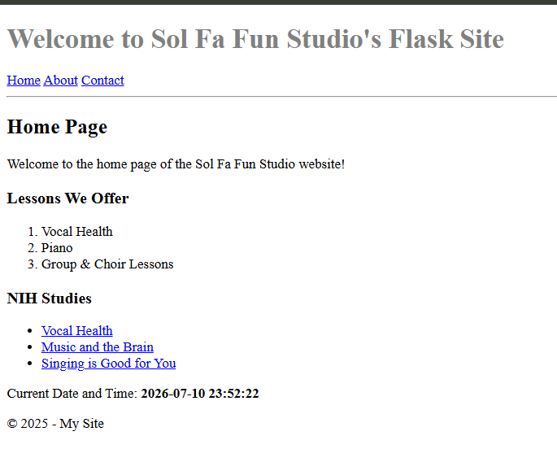
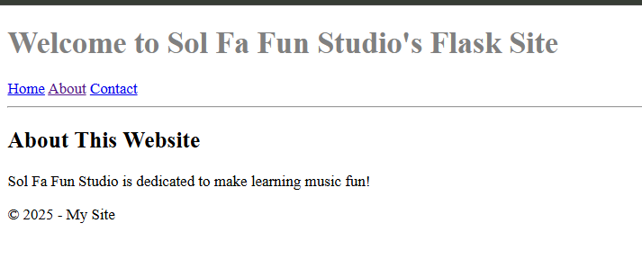
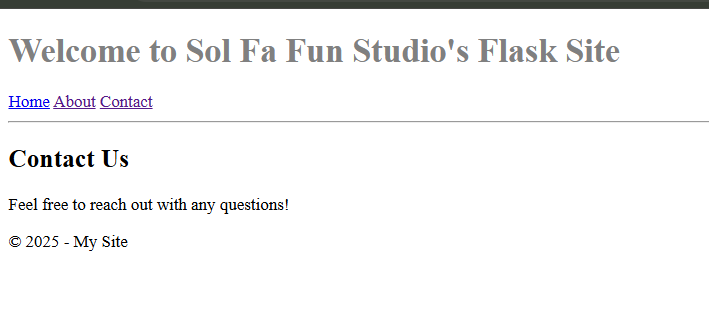

# Flask Music Studio

A multi-page web application built with Python and Flask featuring dynamic routing, reusable Jinja2 templates, shared CSS styling, and server-rendered content.


---

## Overview

This project demonstrates the development of a multi-page web application using Flask and Jinja2 templates. It showcases reusable layouts, server-rendered pages, dynamic content, and organized project structure.

## Features

- Multi-page website
- Shared layout using template inheritance
- Dynamic date and time
- Navigation bar
- External resource links
- Responsive project organization

## Technologies

- Python
- Flask
- HTML5
- CSS3
- Jinja2

## Screenshots

### Home



### About



### Contact



## Installation

### Clone the repository

```bash
git clone https://github.com/jcrosbybuilds/flask-music-studio.git
```

### Install dependencies

```bash
pip install -r requirements.txt
```

### Run the application

```bash
python app.py
```

Open your browser and navigate to:

```
http://127.0.0.1:5000
```

## Project Structure

```text
flask-music-studio/
├── app.py
├── requirements.txt
├── README.md
├── .gitignore
├── screenshots/
│   ├── homepage.png
│   ├── about.png
│   └── contact.png
├── static/
│   └── style.css
└── templates/
    ├── about.html
    ├── base.html
    ├── contact.html
    └── home.html
```

## What I Learned

This project strengthened my understanding of:

- Developing web applications with Flask
- Using Jinja2 template inheritance to create reusable layouts
- Organizing HTML templates and static assets
- Passing dynamic data from Python to HTML templates
- Structuring a small Python web application
- Using Git and GitHub for version control and project documentation

## Future Improvements

- User authentication
- Contact form
- SQLite database
- Responsive design